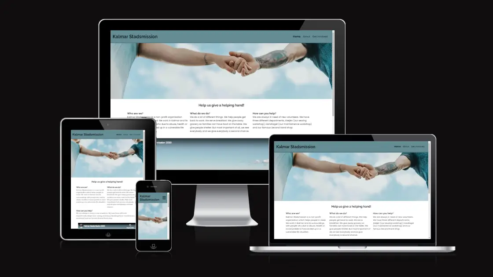
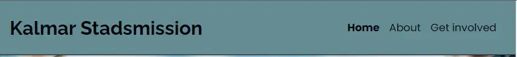
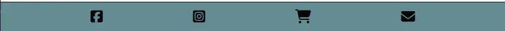
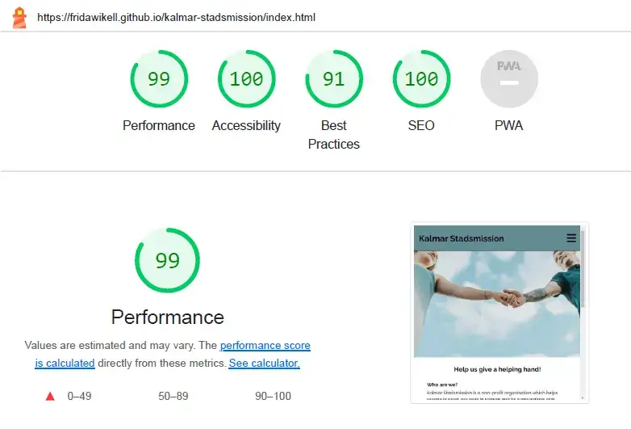

# Kalmar Stadsmission

## Introduction

Kalmar Stadsmission is a site that hopes to get people to sign up to become a volunteer at the non-profit organisation Kalmar Stadsmission. It shows the possibiities in doing something that will give you a meaning in your life, and at the same time help someone in need.

## Table of Contents

## User Experience

### User Stories

#### User Goals

The goal for the user is to learn more about the different areas where you can volunteer at Kalmar Stadsmission. It should also be an easy way to sign up to become a volunteer.

#### Site Owner Goal

It's to get more applications for people who wants to be volunteers.

## Design

The design is simple and made to help the user to focus at the text.

### Color Scheme

The headers color was choosed to pop out next to a white background at a body. It was decided to have a blue/grey color to make the site feel like a calm and trustworthy site. It was generated through coolors.co where the headers color and the fonts color was at the same color palette.

### Typography

The fonts are from Google fonts where the filter was set to show only sans serif fonts. They where choosed to make the text simple to read.

### Imagery

The images was choosed to visualise the text. One requirement was that they should be in color and look like they was taken out or real world.

### Wireframes

## Features

### Index page

#### Navigation bar

It's located in all pages, making it possible to navigate to Home, About and Get involved page at all times. The navigation bar is identical in each page, making it wasy to navigate and recognize on all pages.

#### The landing page image

This image will give the user a feeling of welcome and a feeling that we care about each other at this page.

#### Help us give a helping hand section

It's a short introduction to Kalmar Stadsmission and what they do. It also briefly covers how you can be involved in Kalmar Stadsmission.

#### Video

A short video that shows some thing that Kalmar Stadsmission does to help the people in need.

#### Footer

It's located in all pages, making it possible to navigate to Kalmar Stadsmission's pages at Facebook, Instagram and Tradera. The last icon makes it possible for the user to send a email to Kalmar Stadsmission.

### About

#### How can you help introduction

This is a short introduction that is supposed to be motivating to sign up.

#### The three different areas

The three different areas where you can volunteer is presented. It's presented with a short text and an image that helps represent the area. This is to help the user to decide which are they awnt to volunteer in.

### Get involved

#### Quote from a volunteer

An eye catching image get the user to read what a volunteer has to say about beeing a volunteer.

#### Sign up form

A easy understandable form where you put your contact information to become a volunteer. You also get to choose which of the three areas you want to volunteer in. All fields are mandatory except age. It also has a submit button for sending the form and a reset button for clering the form if the user needs to start over. It is made to be easy, the user should get a feeling that it isn't hard to become a volunteer.

## Features to be Added

A feature of time booking when you want to have your volunteer introduction visit (or just a regular visit) will increase the users value.
To increase the performance of the website in mobile devices, the video at the index page should be optimized and not fully loaded when you visit the site without pressing start.

## Testing

### Validation of Code

All HTML pages are validated without errors in the [W3 Markup Validation Service](https://validator.w3.org/)
The CSS page are validated without errors in the [W3 CSS Validation Service](https://jigsaw.w3.org/css-validator/). One warning appeared; "Imported style sheets are not checked in direct input and file upload modes" which can be ignored since it dowsn't affect the written CSS code.

INSERT SCREENSHOTS!!!

### Lighthouse

The website is tested in Lighthouse, both for mobile and desktop.

#### Mobile

For mobile devices, the performance is 94. The low score is mainly due to the video at the first page. For the moment, the developer doesn't have the skill to fix it due to lack of knowledge. The acccssibility is 100.

#### Desktop

For desktop, the performance is 99 and accessibility 100.

### Wave Webaim - accessibility testing

The test at Wave Webaim gave two errors. These two are conscious errors and are left unfixed due to the developer doesn't have the knowledge to make the toggle bar in JavaScript that would be preferred.

### Manual Testing

In every page at the website has been manually tested. Every link in the header, body and footer has been clicked and checked so it valid. This has been done at every page in the website. The sign up form has been tested by typing in every field, checking the form doesn't allow sending before willing every required field.

The responsivness has been tested in DevTools. It has also been tested through visiting the website in two different desktop sizes and one small device (mobile phone).

## Technologies Used

For the site, HTML and CSS has been used.
It has been based on a GitHub repository and developed in Codeanywhere.
The wireframes has been done in Balsamiq.

## Deployment

The site was deployed to GitHub pages.
- In the GitHub repository, choose Settings tab
- In the left menu, press Pages
- Choose main under branch

Link to the website: https://fridawikell.github.io/kalmar-stadsmission/

## Credits

### Images

Images at respons page and 404 page are free images from pixabay.com.
Images at index page, about page and get involved page is from pexels.com.

The images has been converted to webp with [Convertio](https://convertio.co/) and [Cloudconvert](https://cloudconvert.com/).
[TinyPNG](https://tinypng.com/) has been used to compress the images.

### Code

The code to embed the Youtube-video is from [Avexdesigns](avexdesigns.com/blog/responsive-youtube-embed).
For making the navigation bar responsive, the code is from Code Institue's Love running project.
Button code to make "Back to home page" button is from https://stackoverflow.com/questions/2906582/how-do-i-create-an-html-button-that-acts-like-a-link.

### Other

The favicon is from [Favicon.io](https://favicon.io/emoji-favicons/red-heart) with license [CC BY 4.0 DEED](https://creativecommons.org/licenses/by/4.0/).
The symbols in the footer and the hamburger icon in the navigation menu (when a small device is used) are from [Fontawesome.com](https://fontawesome.com/).

## Acknowledgements

A big thanks to Linus Wikell for the idea and to Matt Bodden for the coding support!

Back to top link to return to the top of the readme.
