# Kalmar Stadsmission

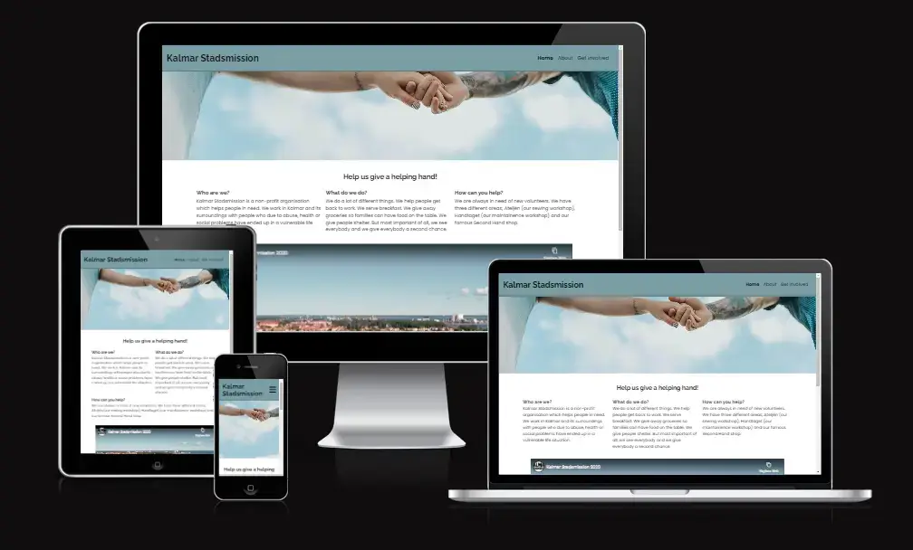

## Introduction

Kalmar Stadsmission is a site that hopes to get people to sign up to become a volunteer at the non-profit organisation Kalmar Stadsmission. It shows the possibiities of doing something that will give you a meaning in your life, and at the same time help someone in need.

## Table of Contents

- [Kalmar Stadsmission](#kalmar-stadsmission)
  - [Introduction](#introduction)
  - [Table of Contents](#table-of-contents)
  - [User Experience](#user-experience)
    - [User Goals](#user-goals)
    - [Site Owner Goal](#site-owner-goal)
  - [Design](#design)
    - [Color Scheme](#color-scheme)
    - [Typography](#typography)
    - [Imagery](#imagery)
    - [Wireframes](#wireframes)
      - [Index page](#index-page)
      - [About page](#about-page)
      - [Get involved page](#get-involved-page)
      - [Other pages](#other-pages)
  - [Features](#features)
    - [Index page](#index-page-1)
      - [Navigation bar](#navigation-bar)
      - [The landing page image](#the-landing-page-image)
      - [Help us give a helping hand section](#help-us-give-a-helping-hand-section)
      - [Video](#video)
      - [Footer](#footer)
    - [About](#about)
      - [How can you help introduction](#how-can-you-help-introduction)
      - [The three different areas](#the-three-different-areas)
    - [Get involved](#get-involved)
      - [Quote from a volunteer](#quote-from-a-volunteer)
      - [Sign up form](#sign-up-form)
  - [Features to be Added](#features-to-be-added)
  - [Testing](#testing)
    - [Validation of Code](#validation-of-code)
    - [Lighthouse](#lighthouse)
      - [Mobile](#mobile)
      - [Desktop](#desktop)
    - [Wave Webaim - accessibility testing](#wave-webaim---accessibility-testing)
    - [Contrast Grid](#contrast-grid)
    - [Manual Testing](#manual-testing)
      - [Navbar](#navbar)
      - [Index page](#index-page-2)
      - [About page](#about-page-1)
      - [Get involved page](#get-involved-page-1)
      - [Respons page](#respons-page)
      - [404 page](#404-page)
      - [Footer](#footer-1)
    - [Bugs](#bugs)
  - [Technologies Used](#technologies-used)
  - [Deployment](#deployment)
  - [Credits](#credits)
    - [Images](#images)
    - [Code](#code)
    - [Other](#other)
  - [Acknowledgements](#acknowledgements)

## User Experience

### User Goals

The goal for the user is to learn more about the different areas where you can volunteer at Kalmar Stadsmission. It should also be an easy way to sign up to become a volunteer.

### Site Owner Goal

It's to get more applications for people who wants to be volunteers.

## Design

The design is simple and made to help the user to focus at the text.

### Color Scheme

The headers color was choosed to pop out next to a white background at the body. It was decided to have a blue/grey color to make the site feel calm and trustworthy. It was generated through coolors.co where the headers color and the fonts color were at the same color palette.

### Typography

The fonts are from Google fonts where the filter was set to show only sans serif fonts. They where choosed to make the text easy to read.

### Imagery

The images was choosed to visualise the text. One requirement was that they should be in color and look like they was taken out of the real world.

### Wireframes

All of the wireframes are made in Balsamiq with the idea of creating an easy structured website.

#### Index page

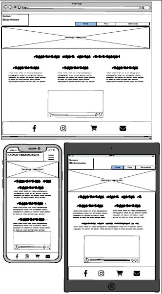

#### About page

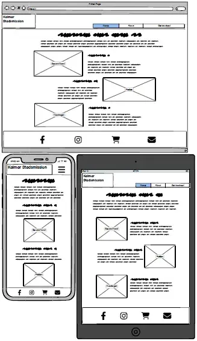

#### Get involved page

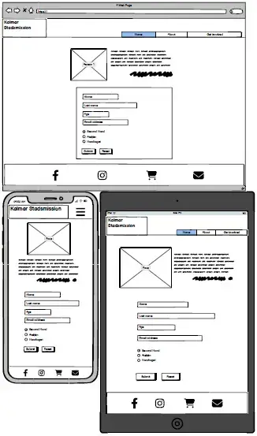

#### Other pages

The wireframes to [404 page](doc/wireframe-error.webp) and [respons page](doc/wireframe-respons.webp) are located in the doc folder.

## Features

### Index page

#### Navigation bar

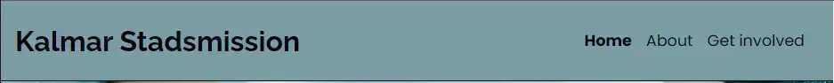

It's located in all pages, making it possible to navigate to Home, About and Get involved page at all times. The navigation bar is identical in each page, making it easy to navigate and recognize all pages.

#### The landing page image

This image will give the user a feeling of welcome and a feeling that we care about each other at this page.

#### Help us give a helping hand section

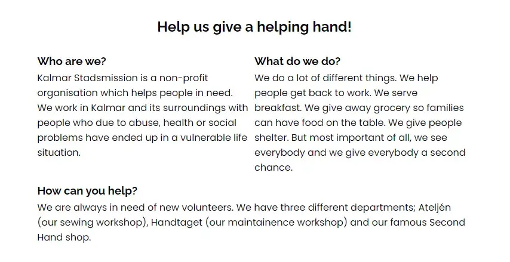

It's a short introduction to Kalmar Stadsmission and what they do. It also briefly covers how you can be involved in Kalmar Stadsmission.

#### Video

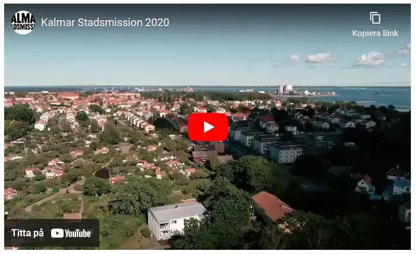

A short video that shows some things Kalmar Stadsmission does to help the people in need.

#### Footer

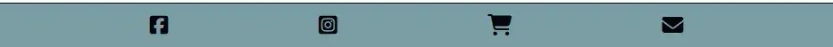

It's located in all pages, making it possible to navigate to Kalmar Stadsmission's pages at Facebook, Instagram and Tradera. The last icon makes it possible for the user to send a email to Kalmar Stadsmission. All links open in a new tab.

### About

#### How can you help introduction

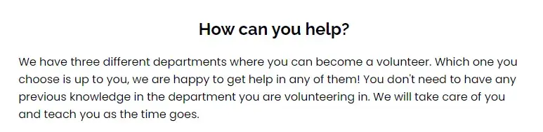

This is a short introduction that is supposed to be motivating to sign up.

#### The three different areas

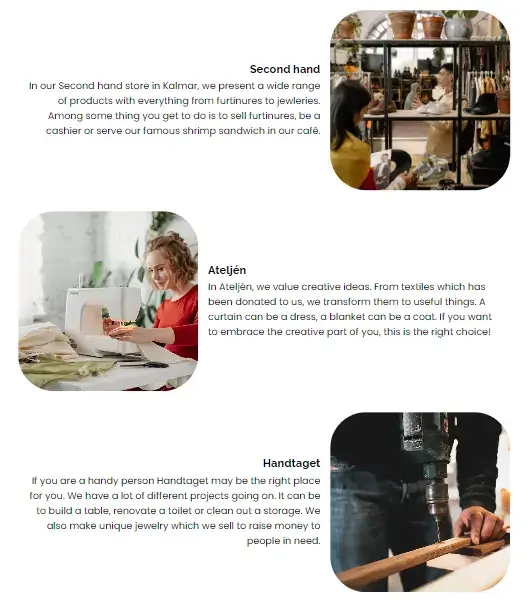

The three different areas where you can volunteer is presented. It's presented with a short text and an image that represent the area. This is to help the user to decide which area they want to volunteer in.

### Get involved

#### Quote from a volunteer

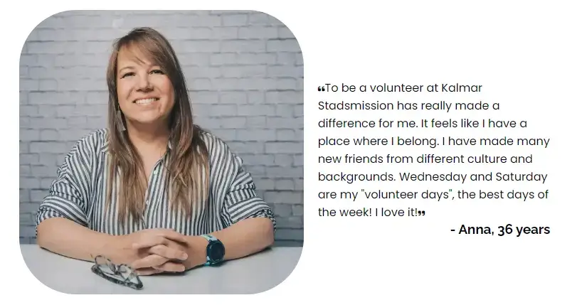

An eye catching image get the user to read what a volunteer has to say about beeing a volunteer.

#### Sign up form

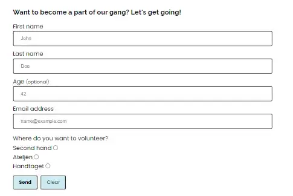

An easy understandable form where you submit your contact information to become a volunteer. You also get to choose which of the three areas you want to volunteer in. All fields are mandatory except age. It also has a submit button for sending the form and a reset button for clering the form if the user needs to start over. It is made to be easy, the user should get a feeling that it isn't hard to become a volunteer.

## Features to be Added

A feature of time booking when you want to have your volunteer introduction visit (or just a regular visit) will increase the users value.

## Testing

### Validation of Code

All HTML pages are validated without errors in the [W3 Markup Validation Service.](https://validator.w3.org/)

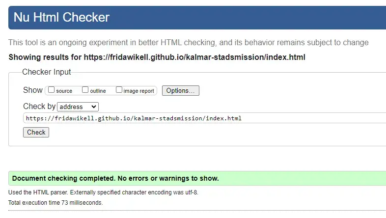

To see the validation at the other pages, you find them in the doc folder.

- [About page](doc/html-about.webp)
- [Get involved page](doc/html-get-involved.webp)
- [Respons page](doc/html-respons.webp)
- [404 page](doc/html-404.webp)

The CSS page are validated without errors in the [W3 CSS Validation Service.](https://jigsaw.w3.org/css-validator/)

### Lighthouse

The website is tested in Lighthouse, both for mobile and desktop.

#### Mobile

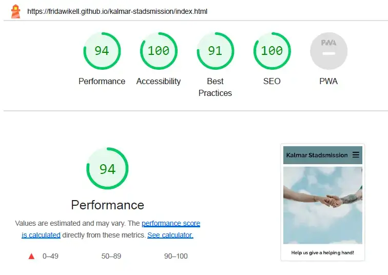

For mobile devices, the performance is 94. The low score is mainly due to the video at the first page. At the moment, the developer doesn't have the skill to fix it due to lack of knowledge. The accessibility is 100.

#### Desktop

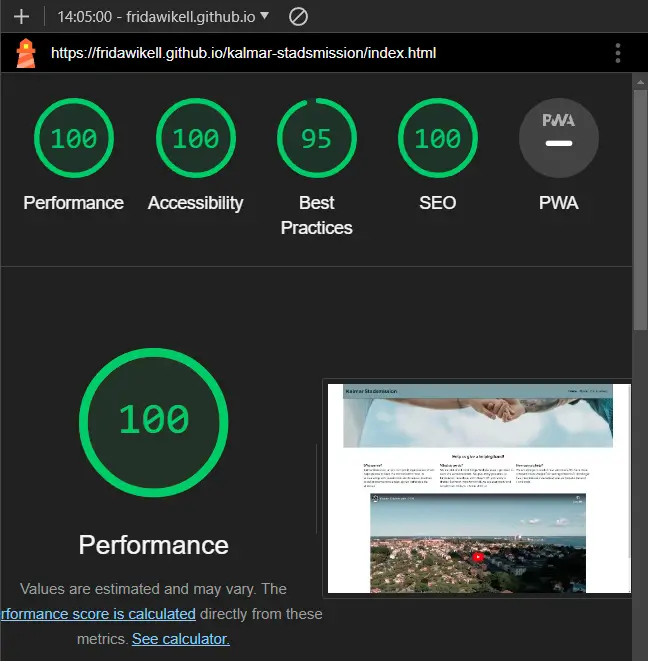

For desktop, the performance and accessibility are 100.

To see the validation at the other pages, you find them in the doc folder.

- [About page](doc/LH-Desktop-about.webp)
- [Get involved page](doc/LH-Desktop-get-involved.webp)
- [Respons page](doc/LH-Desktop-respons.webp)

### Wave Webaim - accessibility testing

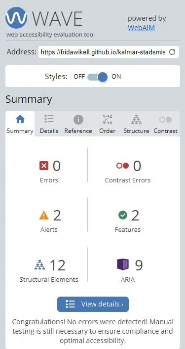

The test at Wave Webaim gave a result without errors.

To see the validation at the other pages, you find them in the doc folder.

- [About page](doc/wave-about.webp)
- [Get involved page](doc/wave-get-involved.webp)
- [Respons page](doc/wave-respons.webp)
- [404 page](doc/wave-404.webp)

### Contrast Grid

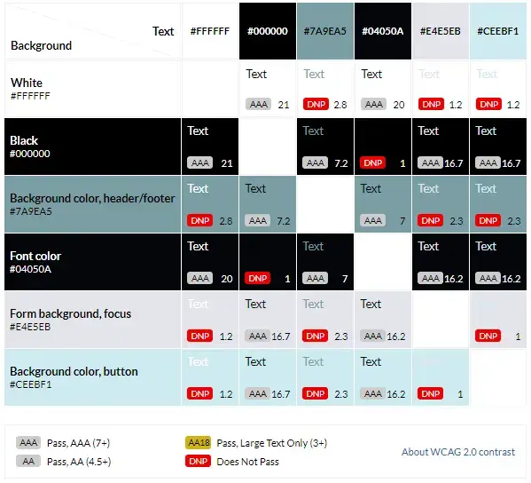

The test at [Contrast Grid](https://contrast-grid.eightshapes.com/?version=1.1.0&background-colors=&foreground-colors=%23FFFFFF%2C%20White%0D%0A%23000000%2C%20Black%0D%0A%237a9ea5%2C%20Background%20color%2C%20header%2Ffooter%0D%0A%2304050a%2C%20Font%20color%0D%0A%23e4e5eb%2C%20Form%20background%2C%20focus%0D%0A%23ceebf1%2C%20Background%20color%2C%20button%0D%0A%0D%0A&es-color-form__tile-size=compact&es-color-form__show-contrast=aaa&es-color-form__show-contrast=aa&es-color-form__show-contrast=aa18&es-color-form__show-contrast=dnp) resulted in only AAA values in the combination used at the site.

### Manual Testing

Every page at the website has been manually tested. It has been done in Google Chrome DevTools and on different devices.
The devices used was one mobile phone, one laptop and one external screen:

- Samsung Galaxy A52s (1080 x 2400)
- HP 250 G4 Notebook PC (1366 x 768)
- HP 2309v LCD Screen (1920 x 1080)

#### Navbar

| Feature being tested | Expected Outcome | Testing Performed | Actual Outcome | Result (Pass or fail) |
| -------------------- | ---------------- | ----------------- | -------------- | --------------------- |
| Navbar | Get stuck at the top when scrolling  | Scrolling the entire page, from top to bottom | Navbar is sticking at the top at the site | Pass |
| Navbar three bar icon | On small devices, being a three bar icon | Choosing a small device in DevTools and visit the site in a cell phone | Showing three bar icon | Pass |
| Clickable three bar icon | Showing the navigation menu when three bar icon is clicked | Click the three bar icon using a small device | Navigation bar showed when three bar icon was clicked | Pass |
| Navbar links | All links works and directs to correct part of the site | Click at every link at the navigation bar | Every link was directing to the correct part of the site | Pass |
| Responsivness navbar | The navbar remains at a readable size when device is changed | Using DevTools to easy change screen size | The navigation bar remained at a readable size when the screen size was changed | Pass |
| Navbar design | Readable and constant design | Check the design at all pages so the design is readable and identical | The design is readable and identical at all pages | Pass |

#### Index page

| Feature being tested | Expected Outcome | Testing Performed | Actual Outcome | Result (Pass or fail) |
| -------------------- | ---------------- | ----------------- | -------------- | --------------------- |
| Hero image | Image fill the pages entire width and stick at the top of the page | Check the index page at different screens through DevTools and check hhe index page at all testing devices | Hero image filled the entire page and was stuck at the top, right uelow the navbar | Pass |
| Readable text | The text is easy readable and is seperated in different columns | The text is read at all testing devices to make sure the text is easy readable | The text is easy to read and have three different, clearly seperated, columns | Pass |
| Responsivness | The image, text and video change size depending which screen size | Screen size changes from larger to smallest screen size in DevTools | All elements changed according to screen size | Pass |
| Video | No autoplay, controls shows when played | Start the video | The video didn't start when the page was visited. The controls shows when the video is started | Pass |

#### About page

| Feature being tested | Expected Outcome | Testing Performed | Actual Outcome | Result (Pass or fail) |
| -------------------- | ---------------- | ----------------- | -------------- | --------------------- |
| Image at correct place | The images are placed to match its content | For all screen sizes, eead through the text to make sure the image is representative | All three images is correct placed at all screen sizes | Pass |
| Responsivness | The text and images adjust comparing to the current screen size | In DevTools and at all testing devices, control so the text and images changes according to screen size | The text and the images adjust comparing to which screen sized used | Pass |
| Readable text | The text is readable and seperated from different columns | In DevTools, change screen size and read through the text | The text is readable and not sticking too close to any other columns | Pass |
| Space between image and text | Space between text and images | Check different screen sizses in DevTools, making sure the space between text and images is still there | It's space between text and images | Pass |

#### Get involved page

| Feature being tested | Expected Outcome | Testing Performed | Actual Outcome | Result (Pass or fail) |
| -------------------- | ---------------- | ----------------- | -------------- | --------------------- |
| Readable text | The text is easy readable | In different screen sizes in DevTools, read through all text | The text was easy to read thanks to space around and good contrast between text and background | Pass |
| Matching text and image | Image and text matches | Look at the image and read through the text | The text is a quote from a woman, 36 years old, which the woman at the image could be | Pass |
| Easy form | An easy understandable form | Try to fill the form in both a testing computer and testing mobile device | All fields were easy to fill and understand what was supposed to be filled in each field | Pass |
| Required fields in form | Not being able to send the form if one of the required fields aren't filled | Try to leave one field empty and try to send the form and repeat for every field | The form wasn't able to send if one (or more) of the required fields were empty | Pass |
| Send button | Direct the user to the respons page | Fill the form and press Send | The Send button directed the user to the respons page | Pass |
| Clear button | Clear the form | Fill the form and press Clear | The form was cleared | Pass |
| Responsivness | All elements change size depending on which screen size used | On all test devices and with the help from DevTools, the page was visited and checked that all elements was readable and not floating on to each other | Pass |

#### Respons page

| Feature being tested | Expected Outcome | Testing Performed | Actual Outcome | Result (Pass or fail) |
| -------------------- | ---------------- | ----------------- | -------------- | --------------------- |
| Responsivness | The text and image changes depending on screen size | In DevTools, change screen size from smallest to largest | The text and image changes size depending on which screen size used | Pass |
| Mail address | Correct mail address which opens the email client when clicked at | Click at the email address | On both testing computer and testing mobile device the email address was clicked at and opened the email client with an empty mail addressed to correct email address | Pass |
| Home page button | Direct the user to home page | Click at the button on the testing devices (computer and mobile) | The user was sent to the home page | Pass |

#### 404 page

| Feature being tested | Expected Outcome | Testing Performed | Actual Outcome | Result (Pass or fail) |
| -------------------- | ---------------- | ----------------- | -------------- | --------------------- |
| Responsivness | The text and image change size depending on screen size | In DevTools and testing devices, change screen sizes | The image and all text change´d size depending on screen size | Pass |
| Home page button | Direct the user to home page | Click at the button on the testing devices (computer and mobile) | The user was sent to the home page | Pass |

#### Footer

| Feature being tested | Expected Outcome | Testing Performed | Actual Outcome | Result (Pass or fail) |
| -------------------- | ---------------- | ----------------- | -------------- | --------------------- |
| Links | All links direct the user to the correct site in a new tab | Click at all links | All links sent the user to the correct site, all links opened in a new tab | Pass |
| Icons | The icons matches the links | Compare the linked site and the icon | The icons matched the linked site | Pass |
| Placement | Always at the bottom of the screen | In DevTools, from small to large screens, check that footer always is at the bottom of the screen | At all screen sizes, the footer was located at the bottom of the screen | Pass |
| Responsivness | The icons spreads out when the screen size gets bigger | Check the icons in the footer in DevTools from small to large screens | The icons spreads out when the screen is getting bigger | Pass |

### Bugs

During the testing some bugs were found.

When the HTML validation was done the first time, it was an error which said anchor tags weren't supposed to be in button tags. It was changed by changing the code to another solution. It didn't get any errors at the next validation. This code was changed once again to make the code easier and more accesible for screen readers.

When the site was tested in Lighthouse, it gave some improvment tips in making the image files smaller to make the loading speed faster. It was made for the image at Get involved page. The hero image at the index page were cropped to make the loading faster.

When the accessibility testing was made in Wave Webaim, one error occured. It was "Empty form label" in the nav bar. It was corrected by adding a Toggle menu text which was made to be hidden, but able to be read by screen readers.

During the contrast test one value was changed to increase the readability. The header and footer originally had #648C94 as background color and #04050A as font color. This combination gave a score of 5.5, equal AA. The background color was changed to #7A9Ea5 which gave a score at 7, equal AAA.

## Technologies Used

For the site, HTML and CSS has been used.
It has been based on a GitHub repository and developed in Codeanywhere.
The wireframes has been done in Balsamiq.

## Deployment

The site was deployed to GitHub pages.

- In the GitHub repository, choose Settings tab
- In the left menu, press Pages
- Choose main under branch

Link to the website: <https://fridawikell.github.io/kalmar-stadsmission/>

## Credits

### Images

Images at respons page and 404 page are free images from [Pixabay.](https://pixabay.com/)
Images at index page, about page and get involved page are from [Pexels.](https://www.pexels.com/)

The images has been converted to .webp with [Convertio](https://convertio.co/) and [Cloudconvert.](https://cloudconvert.com/)
[TinyPNG](https://tinypng.com/) has been used to compress the images.

### Code

The code to embed the Youtube-video is from [Avexdesigns.](https://www.avexdesigns.com/blog/responsive-youtube-embed/)
For making the navigation bar responsive, the code is from Code Institue's Love running project.
To hide Toggle menu, the code is from [CSS Tricks.](https://css-tricks.com/inclusively-hidden/)
Button code to make "Back to home page" button is from [Stackoverflow.](https://stackoverflow.com/questions/8357058/how-to-make-an-html-anchor-tag-or-link-look-like-a-button)
To limit the sites width on large screens, clamp code was used from [Raybo.](https://raybo.org/posts/2021-02-28-CSS%20Clamp/)

### Other

The favicon is from [Favicon](https://favicon.io/emoji-favicons/red-heart) with license [CC BY 4.0 DEED.](https://creativecommons.org/licenses/by/4.0/)
The symbols in the footer and the hamburger icon in the navigation menu (when a small device is used) are from [Fontawesome.](https://fontawesome.com/)

## Acknowledgements

A big thanks to Linus Wikell for the idea and to Matt Bodden for the coding support!

[Back to top](#kalmar-stadsmission)
