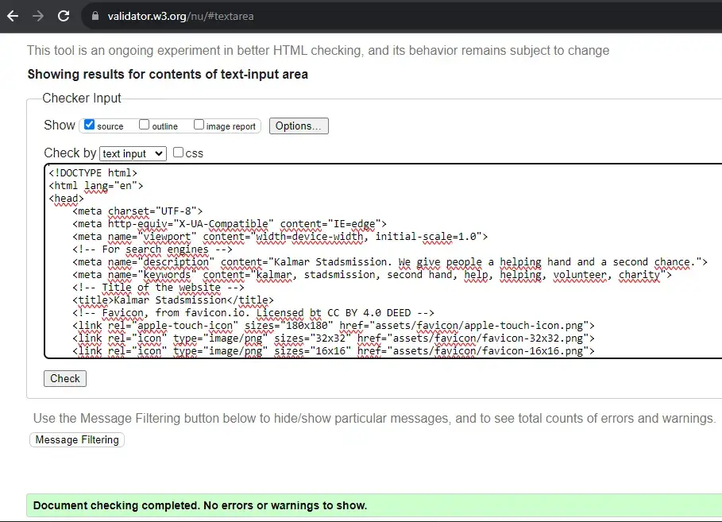

# Kalmar Stadsmission

## Introduction

Kalmar Stadsmission is a site that hopes to get people to sign up to become a volunteer at the non-profit organisation Kalmar Stadsmission. It shows the possibiities of doing something that will give you a meaning in your life, and at the same time help someone in need.

## Table of Contents

- [Kalmar Stadsmission](#kalmar-stadsmission)
  - [Introduction](#introduction)
  - [Table of Contents](#table-of-contents)
  - [User Experience](#user-experience)
    - [User Goals](#user-goals)
    - [Site Owner Goal](#site-owner-goal)
  - [Design](#design)
    - [Color Scheme](#color-scheme)
    - [Typography](#typography)
    - [Imagery](#imagery)
    - [Wireframes](#wireframes)
      - [Index page](#index-page)
      - [About page](#about-page)
      - [Get involved page](#get-involved-page)
      - [Other pages](#other-pages)
  - [Features](#features)
    - [Index page](#index-page-1)
      - [Navigation bar](#navigation-bar)
      - [The landing page image](#the-landing-page-image)
      - [Help us give a helping hand section](#help-us-give-a-helping-hand-section)
      - [Video](#video)
      - [Footer](#footer)
    - [About](#about)
      - [How can you help introduction](#how-can-you-help-introduction)
      - [The three different areas](#the-three-different-areas)
    - [Get involved](#get-involved)
      - [Quote from a volunteer](#quote-from-a-volunteer)
      - [Sign up form](#sign-up-form)
  - [Features to be Added](#features-to-be-added)
  - [Testing](#testing)
    - [Validation of Code](#validation-of-code)
    - [Lighthouse](#lighthouse)
      - [Mobile](#mobile)
      - [Desktop](#desktop)
    - [Wave Webaim - accessibility testing](#wave-webaim---accessibility-testing)
    - [Contrast Grid](#contrast-grid)
    - [Manual Testing](#manual-testing)
    - [Bugs](#bugs)
  - [Technologies Used](#technologies-used)
  - [Deployment](#deployment)
  - [Credits](#credits)
    - [Images](#images)
    - [Code](#code)
    - [Other](#other)
  - [Acknowledgements](#acknowledgements)

## User Experience

### User Goals

The goal for the user is to learn more about the different areas where you can volunteer at Kalmar Stadsmission. It should also be an easy way to sign up to become a volunteer.

### Site Owner Goal

It's to get more applications for people who wants to be volunteers.

## Design

The design is simple and made to help the user to focus at the text.

### Color Scheme

The headers color was choosed to pop out next to a white background at the body. It was decided to have a blue/grey color to make the site feel calm and trustworthy. It was generated through coolors.co where the headers color and the fonts color were at the same color palette.

### Typography

The fonts are from Google fonts where the filter was set to show only sans serif fonts. They where choosed to make the text easy to read.

### Imagery

The images was choosed to visualise the text. One requirement was that they should be in color and look like they was taken out of the real world.

### Wireframes

All of the wireframes are made in Balsamiq with the idea of creating an easy structured website.

#### Index page

#### About page

#### Get involved page

#### Other pages

The wireframes to [404 page](doc/wireframe-error.webp) and [respons page](doc/wireframe-respons.webp) are located in the doc folder.

## Features

### Index page

#### Navigation bar

It's located in all pages, making it possible to navigate to Home, About and Get involved page at all times. The navigation bar is identical in each page, making it easy to navigate and recognize all pages.

#### The landing page image

This image will give the user a feeling of welcome and a feeling that we care about each other at this page.

#### Help us give a helping hand section

It's a short introduction to Kalmar Stadsmission and what they do. It also briefly covers how you can be involved in Kalmar Stadsmission.

#### Video

A short video that shows some things Kalmar Stadsmission does to help the people in need.

#### Footer

It's located in all pages, making it possible to navigate to Kalmar Stadsmission's pages at Facebook, Instagram and Tradera. The last icon makes it possible for the user to send a email to Kalmar Stadsmission. All links open in a new tab.

### About

#### How can you help introduction

This is a short introduction that is supposed to be motivating to sign up.

#### The three different areas

The three different areas where you can volunteer is presented. It's presented with a short text and an image that represent the area. This is to help the user to decide which area they want to volunteer in.

### Get involved

#### Quote from a volunteer

An eye catching image get the user to read what a volunteer has to say about beeing a volunteer.

#### Sign up form

An easy understandable form where you submit your contact information to become a volunteer. You also get to choose which of the three areas you want to volunteer in. All fields are mandatory except age. It also has a submit button for sending the form and a reset button for clering the form if the user needs to start over. It is made to be easy, the user should get a feeling that it isn't hard to become a volunteer.

## Features to be Added

A feature of time booking when you want to have your volunteer introduction visit (or just a regular visit) will increase the users value.
To increase the performance of the website in mobile devices, the video at the index page should be optimized and not fully loaded when you visit the site without pressing start.

## Testing

### Validation of Code

All HTML pages are validated without errors in the [W3 Markup Validation Service.](https://validator.w3.org/)

The CSS page are validated without errors in the [W3 CSS Validation Service.](https://jigsaw.w3.org/css-validator/) One warning appeared; "Imported style sheets are not checked in direct input and file upload modes" which can be ignored since it doesn't affect the written CSS code.

INSERT SCREENSHOTS!!!

### Lighthouse

The website is tested in Lighthouse, both for mobile and desktop.

#### Mobile

For mobile devices, the performance is 94. The low score is mainly due to the video at the first page. At the moment, the developer doesn't have the skill to fix it due to lack of knowledge. The accessibility is 100.

#### Desktop

For desktop, the performance is 99 and accessibility 100.

### Wave Webaim - accessibility testing

The test at Wave Webaim gave two errors: Missing form label and Empty form label. These two are conscious errors and are left unfixed due to the developer doesn't have the knowledge to make the toggle bar in JavaScript that would be preferred.

FIX AND INSERT SCREENSHOT!

### Contrast Grid

The test at [Contrast Grid](https://contrast-grid.eightshapes.com/?version=1.1.0&background-colors=&foreground-colors=%23FFFFFF%2C%20White%0D%0A%23000000%2C%20Black%0D%0A%237a9ea5%2C%20Background%20color%2C%20header%2Ffooter%0D%0A%2304050a%2C%20Font%20color%0D%0A%23e4e5eb%2C%20Form%20background%2C%20focus%0D%0A%23ceebf1%2C%20Background%20color%2C%20button%0D%0A%0D%0A&es-color-form__tile-size=compact&es-color-form__show-contrast=aaa&es-color-form__show-contrast=aa&es-color-form__show-contrast=aa18&es-color-form__show-contrast=dnp) resulted in only AAA values in the combination used at the site.

### Manual Testing

Every page at the website has been manually tested. Every link in the header, body and footer has been clicked and checked so it valid. This has been done at every page in the website. The sign up form has been tested by typing in every field, checking so the form doesn't allow sending before filling every required field.

The responsivness has been tested in DevTools. It has also been tested through visiting the website in two different desktop sizes and one small device (mobile phone).

### Bugs

During the testing some bugs were found.

When the HTML validation was done the first time, it was an error which said anchor tags weren't supposed to be in button tags. It was changed by changing the code to another solution. It didn't get any errors at the next validation. This code was changed once again to make the code easier and more accesible for screen readers.

When the site was tested in Lighthouse, it gave some improvment tips in making the image files smaller to make the loading speed faster. It was made for the image at Get involved page, the only image it warned about.

When the accessibility testing was made in Wave Webaim, two errors occured.

FIX IT!!

During the contrast test one value was changed to increase the readability. The header and footer originally had #648C94 as background color and #04050A as font color. This combination gave a score of 5.5, equal AA. The background color was changed to #7A9Ea5 which gave a score at 7, equal AAA.

## Technologies Used

For the site, HTML and CSS has been used.
It has been based on a GitHub repository and developed in Codeanywhere.
The wireframes has been done in Balsamiq.

## Deployment

The site was deployed to GitHub pages.
- In the GitHub repository, choose Settings tab
- In the left menu, press Pages
- Choose main under branch

Link to the website: (<https://fridawikell.github.io/kalmar-stadsmission/>)

## Credits

### Images

Images at respons page and 404 page are free images from [Pixabay.](https://pixabay.com/)
Images at index page, about page and get involved page are from [Pexels.](https://www.pexels.com/)

The images has been converted to .webp with [Convertio](https://convertio.co/) and [Cloudconvert.](https://cloudconvert.com/)
[TinyPNG](https://tinypng.com/) has been used to compress the images.

### Code

The code to embed the Youtube-video is from [Avexdesigns.](avexdesigns.com/blog/responsive-youtube-embed)
For making the navigation bar responsive, the code is from Code Institue's Love running project.
Button code to make "Back to home page" button is from [Stackoverflow.](https://stackoverflow.com/questions/8357058/how-to-make-an-html-anchor-tag-or-link-look-like-a-button)
To limit the sites width on large screens, clamp code was used from [Raybo.](https://raybo.org/posts/2021-02-28-CSS%20Clamp/)

### Other

The favicon is from [Favicon](https://favicon.io/emoji-favicons/red-heart) with license [CC BY 4.0 DEED.](https://creativecommons.org/licenses/by/4.0/)
The symbols in the footer and the hamburger icon in the navigation menu (when a small device is used) are from [Fontawesome.](https://fontawesome.com/)

## Acknowledgements

A big thanks to Linus Wikell for the idea and to Matt Bodden for the coding support!

[Back to top](#kalmar-stadsmission)
